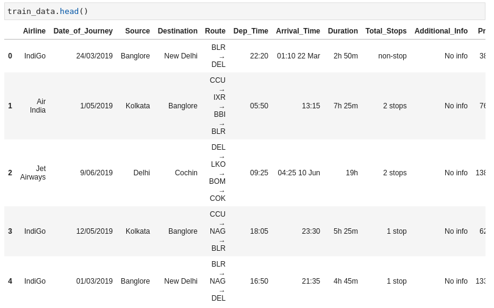
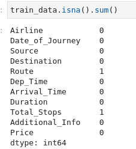
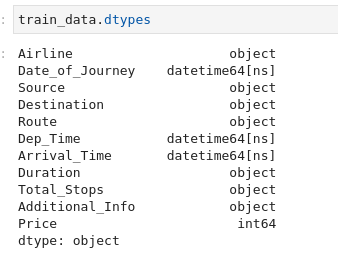
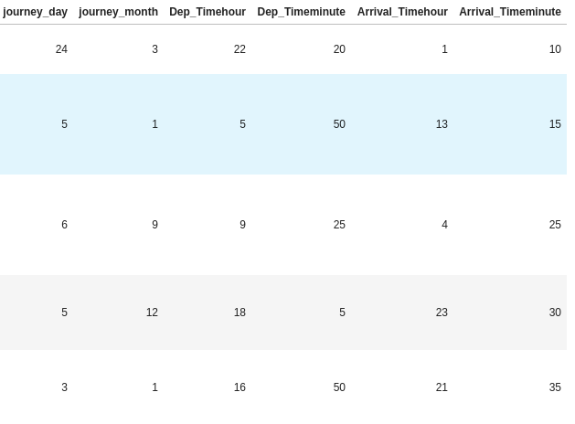
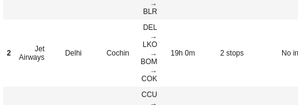
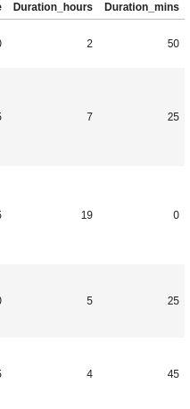
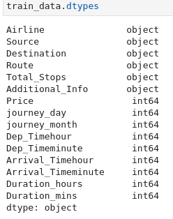

# Project-6-Predict-Fare-of-Airlines-

 
0. [Instalar xlrd ](#schema0)

# a.-Comprensión de datos y Preprocesamiento de datos
1. [Cargar los datos y ver los nulos](#schema1)
2. [Limpiar los datos](#schema2)
3. [Separar las horas y los minutos de duración de la duración](#schema3)
4. [Separa las horas y los minutos](#schema4)

# 0. Instalar xlrd
~~~python
conda install -c anaconda xlrd
~~~
Para poder leer archivos `xlsx`

# 1. Cargar los datos y ver los nulos

~~~python
train_data=pd.read_excel('./data/Data_Train.xlsx')
~~~

En este caso los podemos eliminar porque tenemos bastantes datos y solo dos son nulos.

~~~python
train_data.dropna(inplace = True)
~~~

# 2. Limpiar los datos
Convertir `Data_of_Journey, Dep_Time, Arrival_Time` a datetime, lo hacemos creando una función
~~~python
def change_into_datetime(col):
    train_data[col] = pd.to_datetime(train_data[col])
for time in ['Date_of_Journey','Dep_Time', 'Arrival_Time']:
    change_into_datetime(time)
~~~

Convertir `Date_of_journey` a día y mes

~~~python
train_data['journey_day'] = train_data['Date_of_Journey'].dt.day
train_data['journey_month'] = train_data['Date_of_Journey'].dt.month
~~~
Ahora que tenemos los días y los meses en columnas separadas podemos borrar la columna `Date_of_Journey`

~~~python
train_data.drop('Date_of_Journey',axis = 1, inplace = True)
~~~

Convertir `Dep_Time` y `Arrival_Time` ahora
~~~python
def extract_hour(df,col):
    df[col + 'hour'] = df[col].dt.hour
    
    
def extract_min(df,col):
    df[col + 'minute'] = df[col].dt.minute

    
def drop_col(df,col):
    df.drop(col, axis = 1, inplace = True)

change = ['Dep_Time', 'Arrival_Time']

for col in change:
    
    extract_hour(train_data, col)
    extract_min(train_data, col)
    drop_col(train_data, col)
~~~

# 3. Separar las horas y los minutos de duración de la duración

~~~python
duration=list(train_data['Duration'])

for i in range(len(duration)):
    if len(duration[i].split(' '))==2:
        pass
    else:
        if 'h' in duration[i]:                  
            duration[i]=duration[i] + ' 0m'      
        else:
            duration[i]='0h '+ duration[i]   
train_data['Duration']=duration
~~~

# 4. Separa las horas y los minutos
~~~python
def hour(x):
    return x.split(' ')[0][0:-1]

def minute(x):
    return x.split(' ')[1][0:-1]

train_data['Duration_hours']=train_data['Duration'].apply(hour)
train_data['Duration_mins']=train_data['Duration'].apply(minute)
~~~

Convertir las horas y los minutos a enteros
~~~python
train_data['Duration_hours']=train_data['Duration_hours'].astype(int)
train_data['Duration_mins']=train_data['Duration_mins'].astype(int)
~~~

datos: https://drive.google.com/drive/folders/1QPizxIdGZ7TA9ecSGjDxJFLYNUOC8Kn9