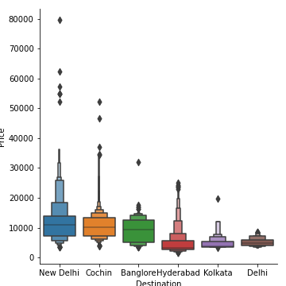

# Project 6 Predict Fare of Airlines 

 
0. [Instalar xlrd ](#schema0)

# a.-Comprensión de datos y Preprocesamiento de datos
1. [Cargar los datos y ver los nulos](#schema1)
2. [Limpiar los datos](#schema2)
3. [Separar las horas y los minutos de duración de la duración](#schema3)
4. [Separa las horas y los minutos](#schema4)
5. [Manejar datos categóricos y características de codificación](#schema5)
6. [Detección de outlier](#schema6)
7. [Seleccione las mejores funciones usando Técnica de selección de funciones](#schema7)
8. [Aplicar la selección de características en los datos](#schema8)

# 0. Instalar xlrd
~~~python
conda install -c anaconda xlrd
~~~
Para poder leer archivos `xlsx`

# 1. Cargar los datos y ver los nulos

~~~python
train_data=pd.read_excel('./data/Data_Train.xlsx')
~~~

En este caso los podemos eliminar porque tenemos bastantes datos y solo dos son nulos.

~~~python
train_data.dropna(inplace = True)
~~~

# 2. Limpiar los datos
Convertir `Data_of_Journey, Dep_Time, Arrival_Time` a datetime, lo hacemos creando una función
~~~python
def change_into_datetime(col):
    train_data[col] = pd.to_datetime(train_data[col])
for time in ['Date_of_Journey','Dep_Time', 'Arrival_Time']:
    change_into_datetime(time)
~~~

Convertir `Date_of_journey` a día y mes

~~~python
train_data['journey_day'] = train_data['Date_of_Journey'].dt.day
train_data['journey_month'] = train_data['Date_of_Journey'].dt.month
~~~
Ahora que tenemos los días y los meses en columnas separadas podemos borrar la columna `Date_of_Journey`

~~~python
train_data.drop('Date_of_Journey',axis = 1, inplace = True)
~~~

Convertir `Dep_Time` y `Arrival_Time` ahora
~~~python
def extract_hour(df,col):
    df[col + 'hour'] = df[col].dt.hour
    
    
def extract_min(df,col):
    df[col + 'minute'] = df[col].dt.minute

    
def drop_col(df,col):
    df.drop(col, axis = 1, inplace = True)

change = ['Dep_Time', 'Arrival_Time']

for col in change:
    
    extract_hour(train_data, col)
    extract_min(train_data, col)
    drop_col(train_data, col)
~~~

# 3. Separar las horas y los minutos de duración de la duración

~~~python
duration=list(train_data['Duration'])

for i in range(len(duration)):
    if len(duration[i].split(' '))==2:
        pass
    else:
        if 'h' in duration[i]:                  
            duration[i]=duration[i] + ' 0m'      
        else:
            duration[i]='0h '+ duration[i]   
train_data['Duration']=duration
~~~

# 4. Separa las horas y los minutos
~~~python
def hour(x):
    return x.split(' ')[0][0:-1]

def minute(x):
    return x.split(' ')[1][0:-1]

train_data['Duration_hours']=train_data['Duration'].apply(hour)
train_data['Duration_mins']=train_data['Duration'].apply(minute)
~~~

Convertir las horas y los minutos a enteros
~~~python
train_data['Duration_hours']=train_data['Duration_hours'].astype(int)
train_data['Duration_mins']=train_data['Duration_mins'].astype(int)
~~~

# 5. Manejar datos categóricos y características de codificación

Manejo de datos categóricos
Estamos utilizando 2 técnicas de codificación principales para convertir datos categóricos en algún formato numérico.

Datos nominales -> los datos no están en ningún orden -> OneHotEncoder se usa en este caso
Datos ordinales -> los datos están en orden -> LabelEncoder se usa en este caso

Aerolínea vs Análisis de precios
~~~python
plt.figure(figsize = (15,5))
sns.boxplot(x = 'Airline', y = 'Price', data = train_data.sort_values('Price',ascending = False))
plt.savefig("./images/airline.png")
~~~

Conclusión -> En el gráfico podemos ver que Jet Airways Business tiene el precio más alto. Aparte de la primera aerolínea, casi todas tienen una mediana similar.

Realizar Total_Stops vs Análisis de precios

~~~python
plt.figure(figsize=(15,5))
sns.boxplot(y='Price',x='Total_Stops',data=train_data.sort_values('Price',ascending=False))
plt.savefig("./images/price.png")
~~~

Como la aerolínea es un dato categórico nominal, realizaremos OneHotEncoding
~~~python
Airline=pd.get_dummies(categorical['Airline'], drop_first=True)
~~~

Source vs Price

~~~python
plt.figure(figsize=(15,5))
sns.catplot(y='Price',x='Source',data=train_data.sort_values('Price',ascending=False),kind='boxen')
plt.savefig("./images/source.png")
~~~

~~~python
Source=pd.get_dummies(categorical['Source'], drop_first=True)
~~~

~~~python
plt.figure(figsize=(15,5))
sns.catplot(y='Price',x='Destination',data=train_data.sort_values('Price',ascending=False),kind='boxen')
plt.savefig("./images/destination.png")
~~~

~~~python
Destination=pd.get_dummies(categorical['Destination'], drop_first=True)
~~~

~~~python
categorical['Route_1']=categorical['Route'].str.split('→').str[0]
categorical['Route_2']=categorical['Route'].str.split('→').str[1]
categorical['Route_3']=categorical['Route'].str.split('→').str[2]
categorical['Route_4']=categorical['Route'].str.split('→').str[3]
categorical['Route_5']=categorical['Route'].str.split('→').str[4]
~~~

Cambiamos los valores `Nan`por `None` en la columna `Route`
~~~python
categorical.isnull().sum()
for i in ['Route_3', 'Route_4', 'Route_5']:
    categorical[i].fillna('None',inplace=True)
~~~
Extraer ahora cuántas categorías hay en cada cat_feature
~~~python
for feature in categorical.columns:
    print('{} has total {} categories \n'.format(feature,len(categorical[feature].value_counts())))
~~~

Como veremos, tenemos muchas funciones en Route, una codificación en caliente no será una mejor opción, permite aplicar la codificación de etiquetas.

~~~python
from sklearn.preprocessing import LabelEncoder
encoder=LabelEncoder()
for i in ['Route_1', 'Route_2', 'Route_3', 'Route_4','Route_5']:
    categorical[i]=encoder.fit_transform(categorical[i])
~~~

Cambiamos lo valores de la columna `Total_Stops`

~~~python
dict={'non-stop':0, '2 stops':2, '1 stop':1, '3 stops':3, '4 stops':4}
categorical['Total_Stops']=categorical['Total_Stops'].map(dict)
~~~

Concatenamos dataframe --> categorical + Airline + Source + Destination
~~~python
data_train=pd.concat([categorical,Airline,Source,Destination,train_data[cont_col]],axis=1)
data_train.drop(columns=['Airline', 'Source','Destination'], inplace = True)
~~~

# 6. Detección de outlier

Función para dibujar
~~~python
def plot(df,col):
    fig,(ax1,ax2)=plt.subplots(2,1)
    sns.distplot(df[col],ax=ax1)
    sns.boxplot(df[col],ax=ax2)
plt.figure(figsize=(30,20))
plot(data_train,'Price')
plt.savefig("./images/out.png")
~~~

Nos quedamos con los valores por debajo de `40000`
~~~python
data_train['Price']=np.where(data_train['Price']>=40000,data_train['Price'].median(),data_train['Price'])
plt.figure(figsize=(30,20))
plot(data_train,'Price')
plt.savefig("./images/no_out.png")
~~~

# 7. Seleccione las mejores funciones usando Técnica de selección de funciones

Separar tus datos independientes y dependientes
~~~python
X=data_train.drop('Price',axis=1)
X.head()
~~~

~~~python
y=data_train['Price']
y
~~~

# 8. Aplicar la selección de características en los datos

~~~python
from sklearn.feature_selection import mutual_info_classif
mutual_info_classif(X,y)
~~~

~~~python
imp=pd.DataFrame(mutual_info_classif(X,y),index=X.columns)
imp
~~~

~~~python
imp.columns = ['importance']
imp.sort_values(by = 'importance', ascending = False)
~~~

datos: https://drive.google.com/drive/folders/1QPizxIdGZ7TA9ecSGjDxJFLYNUOC8Kn9